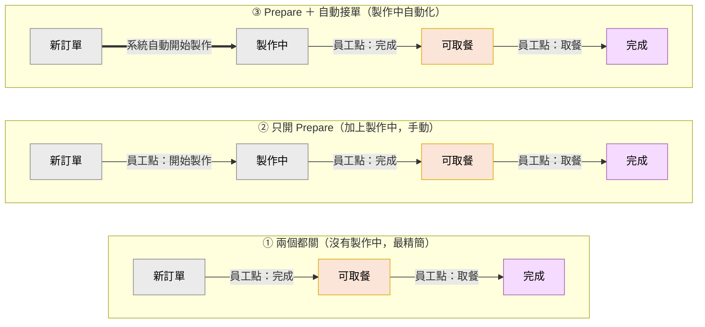

# 訂單狀態流轉

訂單在生命週期中以單字母 status 編碼，POS 端與 KDS 共用同一組常數。

## 狀態常數

定義於 `util/Constants.kt:69-78`：

| 常數 | 字元 | 意義 | 對應頁面 |
|------|------|------|----------|
| `NEW` | `J` | 新進訂單（剛從 POS 進來） | Main（待製作） |
| `PROGRESSING` | `W` | 製作中（按 Progress 後） | Main |
| `PREPARED` | `O` | 已完成（按 Finish 後） | Served（等取餐） |
| `COLLECTED` | `F` | 已取餐（按 Collect 後） | 消失 |

## 狀態轉移

```
[POS下單] ──> J ──Progress──> W ──Finish──> O ──Collect──> F
              └────────Finish────────────────┘    ▲        │
                  (prepareMode 關時跳過 W)         │        │
                                                  └──Recall┘
                                                  (從 Recall Tab)
```

### 三種設定組合的流程對照（白話版，客戶解釋用）

依 Prepare Mode / Auto Accept 兩個開關，層層推進：



| 順序 | 設定 | 跟上一層加了什麼 |
|------|------|------------------|
| ① | 兩個都關 | 基本：新單 → 可取餐 → 取餐，沒有「製作中」 |
| ② | 只開 Prepare | 加上「製作中」階段（員工手動按「開始製作」）|
| ③ | ＋ 自動接單 | 把「開始製作」那一下改成系統自動 |

> 對應狀態碼：製作中=W、可取餐=O、完成=F、新訂單=J（見下方技術說明）。

### ⚠️ W 是**可選**中繼狀態（依 prepareMode 切換）

`Constants.kt` 雖然定義了 W，但實際上**只有開啟 prepareMode 才會出現**。由 [[Prefs偏好設定]] `isPrepareEnable: Boolean`（預設 `false`）控制，[[設定頁]] `PrepareRadio` 切換。

| prepareMode | 流程 | 員工點按次數 |
|-------------|------|------------|
| **關（預設）** | `J → O → F` | 2 次（Finish, Collect） |
| **開** | `J → W → O → F` | 3 次（Prepare, Finish, Collect） |

實作於 [[MainPage]] `MainFeatureBtn`（`MainPage.kt:280-290`）：

```kotlin
if (orderStatus != PROGRESSING && prefs.isPrepareEnable) {
    orderStatus = PROGRESSING   // ← 只有此處會把 NEW 推到 PROGRESSING
    progressing()
} else {
    finish()                    // prepareMode 關 → J 直接到 O
}
```

> 名稱誤導：「Prepare 模式」聽起來像「啟用準備功能」，實際意義是「**啟用『製作中』中繼狀態**」。適合製作耗時較長的店家（廚房食物 vs 即沖即取的飲料）。

事件對應（`CentralContract.kt:24-27`）：

| Event | 預設 status | 觸發處 |
|-------|-------------|--------|
| `FinishOrder(order, status="O")` | PREPARED | MainPage Finish 按鈕 |
| `ProgressOrder(order, status="W")` | PROGRESSING | MainPage Progress 按鈕 |
| `CollectedOrder(orderNo, status="F")` | COLLECTED | ServedPage Collected 按鈕 |
| `RecallOrder(orderNo, status="O")` | PREPARED | RecallPage Recall 按鈕（重置為已完成） |

四個事件 handler 都呼叫 `setOrderStatus(orderNo, status)`（`CentralViewModel.kt:352/362/377/382`）。

## API: SetOrderStatus

**Endpoint**：`POS_SET_ORDER_STATUS = "/KDS/SetOrderStatus"`（`Constants.kt:22`）

**Request body**（`SetOrderStatusRequest`）：
```kotlin
data class SetOrderStatusRequest(
    @Json(name = "OrderNo") val orderNo: String,
    @Json(name = "Status")  val status: String,
    @Json(name = "KDS_ID")  val kdsId: String = prefs.kdsId,
)
```

`KDS_ID` 預設帶當前裝置的 `prefs.kdsId`（在設定頁配置）。

**Response**：`ApiResult<Int>`（回傳 int 但 ViewModel 沒用到具體值，只看成功/失敗）。

## 成功後的本地處理（CentralViewModel.kt:660-725）

```kotlin
if (status == PREPARED || status == COLLECTED) {
    // 2026-06-03 暫時註解停用（目前不需要 server 推播）
    // if (status == PREPARED && orderNo.startsWith("E")) {
    //     setOrdersNotify(orderNo)     // 推播給遠端 Compass（E 開頭=線上單）
    // }
    // 更新 mainList & recallList 對應項目 isVisible=false
} else {
    // 更新 servedList 對應項目 isVisible=false（給 Recall 走的路徑）
}
animateBufferGap = true                 // 輪詢加速：1 秒後補一次 fetch
```

> 注意：Collect (F) 進入第一個分支，但更新 mainList/recallList 在資料上是 no-op
> （collected 的訂單不在這兩個 list 裡），詳見 [[ISSUE-Collect死碼]]。

## 額外推播（E 開頭訂單）

> ⚠️ **2026-06-03 已暫時註解停用**：`setOrderStatus` 成功分支內呼叫 `setOrdersNotify` 的那段已被註解（目前不需要 server 推播）。`setOrdersNotify()` 函式本體保留，方便日後恢復。下方為原設計說明。

當 status=PREPARED 且 orderNo 以 "E" 開頭，額外打：

`SERVER_SET_ORDERS_NOTIFY = "KDS/OrdersNotify"` 到遠端 Compass 服務（`prefs.serverBaseUrl`），通知客戶「餐點已準備好」。Request body 帶 `storeNo + orderNo`。

實作：`CentralViewModel.kt` `setOrdersNotify()`（呼叫點已註解）。

## 關聯

- 用此狀態的頁面：[[KDS訂單管理]] / [[MainPage]]
- API 完整清單：[[POS-API端點]]
- 控制中繼態的設定：[[Prefs偏好設定]] (isPrepareEnable) / [[設定頁]]
- 已知行為差異：[[ISSUE-Collect動畫缺失]] / [[ISSUE-Collect死碼]]
- 影響此流程：[[自動接單功能]] — **已實作（2026-06-03）**，新增「自動 J→W」路徑（輪詢 fetchOrders main 成功後，autoAccept+prepareMode 皆開時把 J 單自動派 W），待實機驗證


## 2026-06-04 簡體標籤改名（純顯示，狀態碼不變）
僅改 values-zh-rSG 字串，狀態碼 J/W/O/F 不變:
| string | 原 | 改 | 位置 |
|--------|----|----|------|
| `prepared`(O) | 已处理 | **待取餐** | 主頁待取卡片按鈕 |
| `collected`(F) | 已取餐 | **已完成** | 已完成頁綠色標示（按鈕 onClick 為空，純標示，見 [[ISSUE-Collect死碼]]）|
英文版未動。


## 2026-06-04 修正：按鈕顯示一律依實際狀態（解耦 prepareMode）

**問題**：同一筆 W(製作中)訂單，在 prepareMode 關閉的裝置上按鈕被顯示成「新单」。起因 [[MainPage]] `MainFeatureBtn` 的**文字/顏色判斷混入了 `prefs.isPrepareEnable`**：prepare 關時 `!isPrepareEnable` 為真，W 被當成非-W 而顯示 prepare(新单)。兩台同為 KDS_ID=01 但 prepareMode 設定不同時就會看到差異。

**修正**（`MainPage.kt` MainFeatureBtn）：
- 文字改為純依 `orderStatus`：`W→preparing(处理中) / O→prepared(待取餐) / 其餘(J)→prepare(新单)`
- 顏色同理：`W/O→ColorPrimary、J→ColorBlue`，不再讀 isPrepareEnable
- 'click to finish' 提示改為 `orderStatus == PROGRESSING` 即顯示
- **onClick 轉移邏輯保持不變**：`isPrepareEnable` 仍只決定「J 點擊要先進 W 還是直接 finish→O」

**原則**：prepareMode 只決定「**這台之後進來的單要不要經過 W 中繼態**」（影響新進 J 單的轉移路徑），**不會回頭改變既有訂單（尤其已是 W 的單）的狀態或顯示**。按鈕顯示永遠忠實反映訂單真實狀態，跨裝置一致；對已是 W 的單，點擊一律 finish→O，不看本機 prepareMode。


## 2026-06-04 加點支援 + SetStatus 來源狀態感知（見 [[加點處理]]）
- **per-item 狀態**：API `Detail` 新增 `ItemStatus`，前端可分辨同單新舊品項（加點 = 同單有 j 又有 W/O）。
- **SetStatus 改來源狀態感知**：請求可帶 `FromStatus`（逗號分隔），`UPDATE ... AND ItemStatus IN @FromStatuses`，只搬對應來源狀態品項；空=整單(向後相容)。修正「混合狀態訂單按接單/完成會把不該動的品項一起改」的 bug。並清掉原本永不 match 的死碼(`if(req.Status=="preparing")...`)。
- **各動作 FromStatus**：接單 j,J→W｜完成 W→O｜取餐 O→F｜召回 O,F→O。
- **前端卡片**改用 `Order.displayStatus()`：有 j→新單 / 否則 W→製作中 / 否則 O→待取（後端未提供 itemStatus 時回退整單 status）。
- ⚠️ 後端需部署到 192.168.0.162 才生效。


## 2026-06-05 召回(Recall)動作語意釐清
- **完成**(FinishOrder)：W→O(待取餐)。
- **取餐**(CollectedOrder)：O→F(已完成)，離開主頁。
- **召回**(RecallOrder)：`setOrderStatus(status=O, fromStatus=O,F)` → 把該單 O/F 品項設回 **O(待取餐)** 並 **Finishtime=GETDATE()**。
  - 主要用途：已取餐(F)的單被「叫回」變回待取餐(重新出現在主頁)。
  - 對已是 O 的單：狀態不變，只刷新 Finishtime（重置召回 2 小時視窗）。
- **召回頁顯示條件**：`ItemStatus IN('O','F') AND Finishtime >= 近2小時`（所以較早完成的單會自動掉出召回；已完成頁則顯示當日全部 F，無時間限制）。
